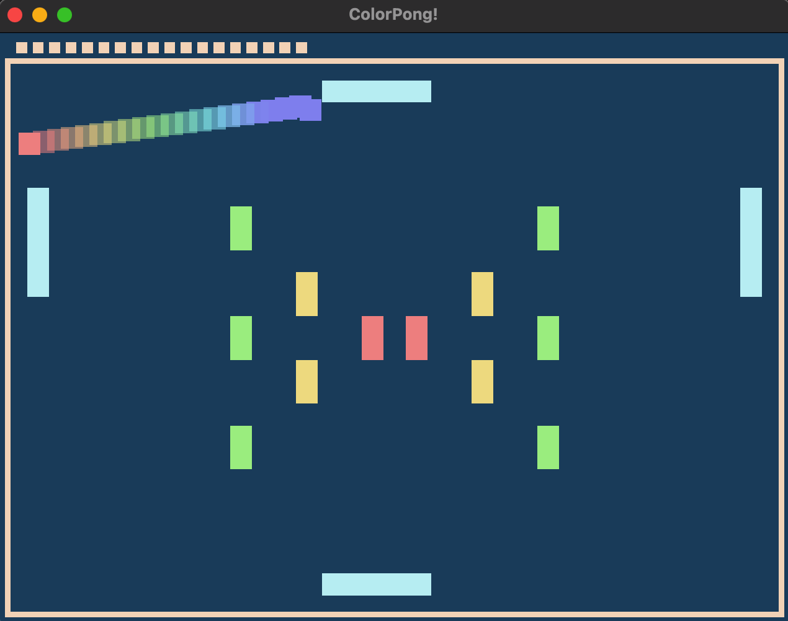

# ColorPong!

Author: Wish Kuo (Andrew ID: chihhsuk)

Design: Try to hit rectangles with the ball in the same color, the color of the ball will change after each time it hits the rectangles.

Screen Shot:

How To Play:

Simply swipe your mouse to control the 4 paddles. Swipt left/right for the upper and lower one, up/down for the left and right one.
The rectangles in the middle are your target, try to hit the colorful rectangles while the ball's color matches the one you hit.
Hit red rectangles for 3 points, yellow ones for 2 points, and green ones for 1 point.
Note the ball's color will change every time when you hit the rectangles.
Your goal is to earn as many points as you can!

This game was built with [NEST](NEST.md).
